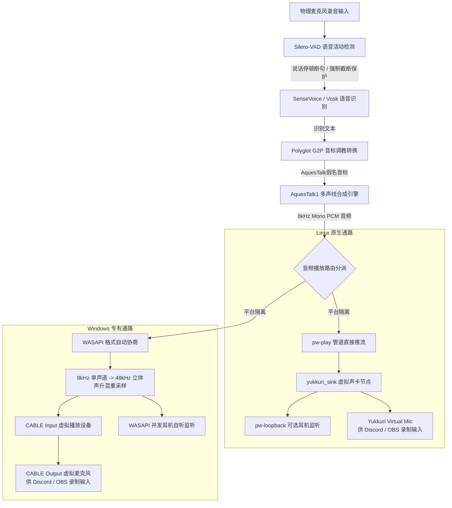

# yukkuri_app

[%20%7C%20Windows%20(WASAPI)-blue.svg)](https://github.com/2onic/yukkuri_app)
[](https://www.python.org/)
[](https://github.com/FunAudioLLM/SenseVoice)
[](https://www.a-quest.com/)
[](LICENSE)

一个跨平台的**实时语音转油库里音效**虚拟麦克风工具（支持 Linux PipeWire 与 Windows WASAPI）。

说出普通话、英语或日语，程序将实时识别，并通过 **AquesTalk1** 引擎实时合成出油库里语音，注入到虚拟麦克风节点中。可在 Discord、腾讯会议、OBS中直接作为麦克风使用。

> [!WARNING]
> **关于 Windows 兼容模式的声明**：  
> 该工具**主要针对 Linux (PipeWire) 开发与优化，不保证 Windows 兼容模式能完全正常工作**。Windows 支持属于实验性质，依赖第三方 VB-CABLE 驱动与 WASAPI 升混，不同系统版本和声卡硬件可能存在差异。

---

## 核心特性

- **多声线自由切换 (9 种经典声线)**：
  - 支持 **f1** (女声1)、**f2** (女声2)、**f3** (女声3)、**m1/m2** (男声1/2)、**imd1** (中性音)、**jgr** (机械音)、**dvd** (播音员)、**r1** (机器人)；
  - GUI 界面支持运行中**实时热切换**，命令行支持 `--voice` 选项。
- **经典油库里空耳调教 (Polyglot G2P)**：
  - **中文**：自动将汉字转为拼音并映射为油库里假名音标（如 *“你好”* -> `にー/はお`，*“我是油库里”* -> `うぉ/しー/ゆっくり`）；
  - **英文**：常用词外来语化 + 音节音译 + 字母拼读（如 *“Hello world”* -> `へろー/わーるど`，*“CPU”* -> `しーぴーゆー`）；
  - **日文**：原生假名合成，自动纠偏助词读音（`は/へ` -> `わ/え`）；
  - **中英日数字混排**：多语言混合自然发音，无需繁琐切换语种。
- **智能 VAD 与断句保护**：
  - 说话停顿自适应切片（支持 200ms ~ 700ms 动态滑块调节）；
  - **最长单句截断保护 (Max Speech Duration)**：防止长句或高环境底噪下积压超长语音缓冲导致卡顿（默认 6.0s，可调 2.0s ~ 15.0s，且支持手动关闭）。
- **麦克风软件增益 (Mic Software Gain)**：
  - 支持 0.5x ~ 3.0x（默认 1.0x 标准音量）无级调节，有效解决麦克风拾音偏小或过大的问题。
- **跨平台物理隔离音频推流**：
  - **Linux 平台**：完全基于 PipeWire / PulseAudio 原生管道（`pw-play --target yukkuri_sink`），运行时自动通过 `pactl` 动态创建与清理虚拟麦克风（`Yukkuri Virtual Mic`），100% 杜绝 sounddevice 播放通道污染；
  - **Windows 平台**：适配 VB-Audio Virtual Cable + WASAPI 专有输出，内置自动采样率协商与 8000Hz Mono -> 48000Hz Stereo 双声道升混重采样。

---

## 系统架构



---

## 快速上手

### 1. 克隆仓库与安装依赖

```bash
git clone https://github.com/2onic/yukkuri_app.git
cd yukkuri_app

# 安装依赖并注册 yukkuri 与 yukkuri-gui 命令行
pip install -e .
```

### 2. 模型下载与 AquesTalk 声线库导入

本项目提供**跨平台一键配置脚本**（支持 Windows 与 Linux，无需 bash/curl/tar 等外部工具）：

```bash
# 跨平台推荐（下载 Silero-VAD + SenseVoice 并自动扫描 AquesTalk）：
python setup_models.py

# 导入 AquesTalk 多声线库（支持 zip、解压目录或 dll/so 库路径；留空则自动扫描）：
python setup_models.py --aquestalk [文件或目录路径]

# 查看当前各模型与声线库就绪状态表格：
python setup_models.py --check

# Linux 环境亦可直接执行脚本：
./setup_models.sh
```

> **关于 AquesTalk 专有授权的特别声明**：  
> `libAquesTalk.so` (Linux) / `AquesTalk.dll` (Windows) 属于 **[株式会社アクエスト (Aquest Corp.)](https://www.a-quest.com/)** 的专有知识产权，本项目遵循开源许可**严禁且绝不自带打包或二次分发**其动态库文件。  
> 用户请前往 [AQUEST 官方下载页](https://www.a-quest.com/download.html) 免费获取相应平台的评价版，解压后通过 `python setup_models.py --aquestalk` 或在 GUI 对话框中导入即可解锁全套 9 种声线。

---

### 3. 运行转换器

#### 方式 A：启动现代桌面图形界面 (GUI，推荐)

- **Linux**：
  ```bash
  ./run.sh --gui
  # 或直接运行全局命令
  yukkuri-gui
  ```
- **Windows**：
  - 直接双击运行目录下的 **`run.bat`**；
  - 或在命令行中运行：`python -m yukkuri.cli --gui`

#### 方式 B：终端命令行启动 (CLI)

```bash
# Linux
./run.sh
./run.sh --loopback --voice f2

# Windows
python -m yukkuri.cli
python -m yukkuri.cli --loopback --voice f2
```

---

## Windows 平台使用指南

> [!WARNING]
> **兼容性声明**：该工具主要针对 Linux 环境开发与测试，Windows 兼容模式属于实验性功能，**不保证在所有 Windows 版本或音频硬件上能完全正常工作**。

1. **安装虚拟声卡驱动**：  
   前往 [VB-Audio Virtual Cable 官网](https://vb-audio.com/Cable/) 下载安装免费版驱动（安装完成后可能需要重启电脑一次）。
2. **下载模型与导入声线**：  
   在终端运行 `python setup_models.py`，并将下载的 `AquesTalk.dll` 或 `aqtk1-win` 目录导入。
3. **启动程序与语音软件配置**：  
   - 双击运行 `run.bat`，点击 **【启动转换器】**；
   - 打开 Discord、微信、QQ、腾讯会议、OBS 等语音或直播软件；
   - 将软件中的**麦克风输入设备**选为：**`CABLE Output (VB-Audio Virtual Cable)`** 即可。

---

## 进阶命令行参数说明

`yukkuri` 命令与 `./run.sh` 完整支持以下参数：

| 参数 | 默认值 | 作用说明 |
| :--- | :--- | :--- |
| `--engine` | `sensevoice` | 识别引擎：`sensevoice`（默认端到端高精度）或 `vosk`（轻量传统离线） |
| `--voice` | `f1` | 油库里声线：`f1`, `f2`, `f3`, `m1`, `m2`, `imd1`, `jgr`, `dvd`, `r1` |
| `--speed` | `100` | 说话语速百分比（50 ~ 300，推荐 `80` ~ `140`） |
| `--mic-gain` | `1.0` | 麦克风软件增益倍数（`0.5` ~ `3.0`） |
| `--max-speech-duration` | `6.0` | 最长单句强制截断保护时长（秒，设为 0 或负数则关闭截断） |
| `--no-max-speech` | - | 手动关闭最长单句截断保护 |
| `--loopback`, `--monitor` | 关闭 | 开启本地耳机实时回放自听监听 |
| `--device` | 系统默认 | 输入麦克风设备 ID |
| `--output-device` | 系统默认 | 目标播放设备 ID（Windows 默认自动匹配 `CABLE Input`） |
| `--monitor-device` | 系统默认 | 本地回放监听输出设备 ID（耳机/扬声器） |
| `--lang` | `zh` | 发音/模型主语种（`zh`, `ja`, `en`；SenseVoice 原生支持多语种混读） |
| `--target` | `yukkuri_sink` | Linux PipeWire 输出目标 Sink 名称 |
| `--no-dynamic-mic` | - | 禁用 Linux pactl 自动动态加载/卸载虚拟声卡 |
| `--list-devices` | - | 列出当前系统的所有音频输入输出设备及其编号并退出 |
| `--gui` | - | 启动桌面图形控制界面 |

---

## 版权与免责声明

1. **AquesTalk1**：
   - 本项目本身**不打包、不分发任何 AquesTalk 二进制专有动态库**；
   - 语音合成引擎及动态库（`libAquesTalk.so` / `AquesTalk.dll`）属于 **[株式会社アクエスト (Aquest Corp.)](https://www.a-quest.com/)** 的版权财产，不受本项目 MIT 协议管辖；
   - 个人非商业用途请遵守官方使用条款。如需商业用途，请向 AQUEST 申请正式商业授权。
2. **开源组件与依赖**：
   - SenseVoice、sherpa-onnx、Vosk 遵循 Apache-2.0 开源协议；
   - Silero VAD、CustomTkinter 遵循 MIT 开源协议；
   - PipeWire 遵循 MIT / LGPL 开源协议；
   - VB-Audio Virtual Cable 为 Vincent Burel / VB-Audio Software 的独立声卡驱动产品。
3. **免责声明**：
   - 本工具仅供个人娱乐、语音技术交流及二创研究使用；
   - 使用者通过本工具采集、合成与广播的任何音频内容，其合规性与法律责任由使用者自行承担，严禁用于侵犯他人合法权益或违法违规场景。
